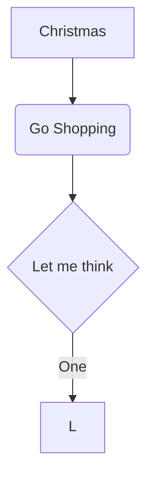

1. 字体
# 一号标题
## 二号标题
### 三号标题
#### 四号标题
##### 五号标题
###### 六号标题

水平分界线

---

~~中划线~~


[显示文本](链接地址)


2. 代码区
```php
echo '这是代码区';
echo phpinfo();
```


3. To-do List
### To-do List
- [X] 已完成项目一
  - [X] 已完成事项一
  - [X] 已完成事项二
- [ ] 待办事项一
- [ ] 待办事项二

4. 流程图

```flow
st=>start: Start:>https://www.zybuluo.com
io=>inputoutput: verification
op=>operation: Your Operation
cond=>condition: Yes or No?
sub=>subroutine: Your Subroutine
e=>end

st->io->op->cond
cond(yes)->e
cond(no)->sub->io
```