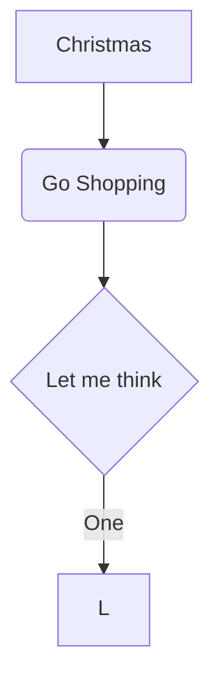

1. 代码高亮
### 代码高亮
代码不高亮


2. 代码区
``` PHP
echo '这是代码区';
echo phpinfo();
```


3. To-do List
### To-do List
- [X] 已完成项目一
  - [X] 已完成事项一
  - [X] 已完成事项二
- [ ] 待办事项一
- [ ] 待办事项二

4. 流程图

```mermaid
graph TD
    A[Christmas] -->B(Go Shopping)
    B --> C{Let me think}
    C -->|One| D[L]
```
